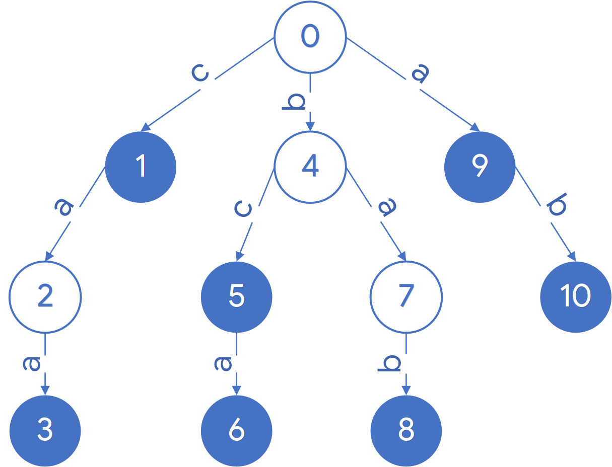
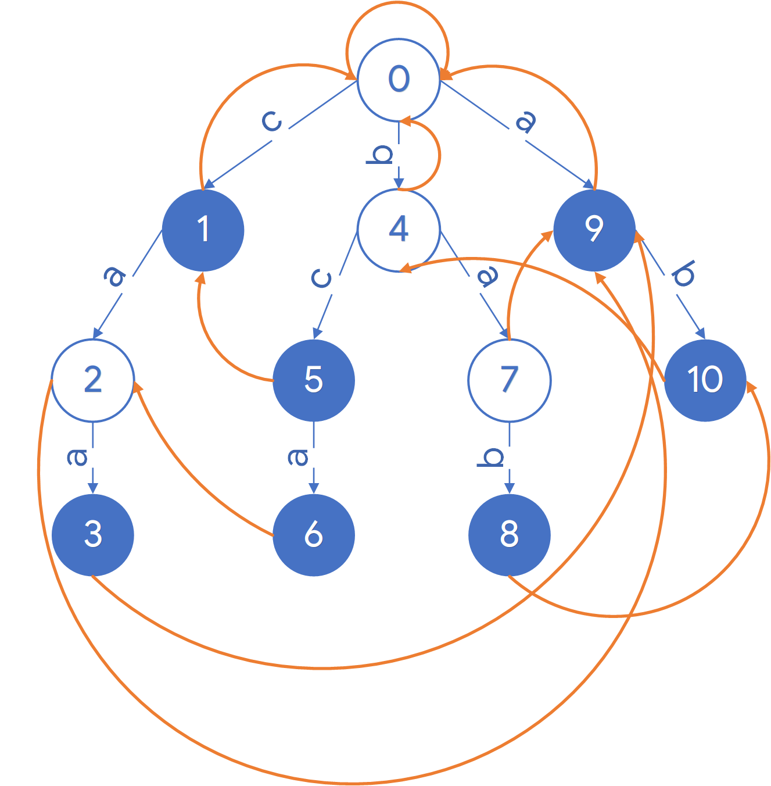

# AC自动机

AC自动机：Aho-Corasick automation，一种多模式字符串匹配算法。给出一个目标字符串和若干个需要匹配的字符串，找出这些字符串在目标字符串中所有的匹配。

算法的关键在于构建了一个有限状态机，用TRIE树实现，其使用了节点的指针作为一次失败匹配后的回退，找出与这次失败匹配字符串的真后缀和一个字符串的前缀相同的字符串来减少匹配次数，避免重复匹配，提供匹配效率。

算法分为三个步骤：1.构建TRIE树 2.构建失配指针 3.查询

TRIE树定义如下：

> **trie**，又称**前缀树**或**字典树**，是一种有序[树](https://zh.wikipedia.org/wiki/树_(数据结构))，用于保存[关联数组](https://zh.wikipedia.org/wiki/关联数组)，其中的键通常是[字符串](https://zh.wikipedia.org/wiki/字符串)。与[二叉查找树](https://zh.wikipedia.org/wiki/二叉查找树)不同，键不是直接保存在节点中，而是由节点在树中的位置决定。一个节点的所有子孙都有相同的[前缀](https://zh.wikipedia.org/wiki/前缀)，也就是这个节点对应的字符串，而根节点对应[空字符串](https://zh.wikipedia.org/wiki/空字符串)。一般情况下，不是所有的节点都有对应的值，只有叶子节点和部分内部节点所对应的键才有相关的值。

首先确定数据结构TRIE树如下。

```c
#include <ctype.h>
#include <stdio.h>
#include <stdlib.h>
#include <string.h>
#define WORD 26  //英文字母数
struct Node {
  struct Node* fail;        //失配指针
  struct Node* next[WORD];  //后继指针，最多26个，没有的为NULL
  int count;  //记录节点是否是字符串的结尾字符，-1为默认值，其他非负值作为模式串下标
};
struct Node* Queue[50000];  //简易队列
int head = 0, tail = 0;     //队列头尾标志
```



为了简化问题，这里假定字符串均由小写英文字母组成，上图展示了一个简单的TRIE树，其中实心节点表示这是一个单词的结尾节点，空心节点不是一个单词结尾节点。这样，上图就表示了{`c`,`caa`,`bc`,`bca`,`bab`,`a`,`ab`}。

在结构中不直接保存字符，而是通过指针的位置来确定是否有字符存在。在这个结构中访问`next[0]`如果指针为空，则表示这个节点后面没有字符`a` 存在，如果不是空，说明这个节点后面有字符`a`连接。

## 构建TRIE树

下面开始构建TRIE树，需要的就是若干需要匹配的字符串。

函数传入一个字符串，对字符串的每个字符处理。

```
//伪代码
p = root
for char in string
	index = char - 'a'
	if p->next[index] == NULL
		node = init()
	p = p->next[index]
p->count = string_index
```

首先将字符转换为对应的索引，用字符减去`a` 即可；

然后查看`root`节点的对应索引处是否存在节点，如果不存在则创建一个新节点并初始化，随后将指针指向新创建的节点；

如果存在，直接将指针移到这个节点即可。重复这个操作直到单词结尾，在最后一个字母所在节点的count值置为这个字符串的索引，以便查找时显示。

```c
/*
向Trie树中插入新模式串
string:新模式字符串
root:Trie树根节点
index:插入串的下标
 */
void insert(char* string, struct Node* root, int index) {
  struct Node* p = root;
  int i = 0;
  while (string[i]) {
    if (isalpha(string[i])) {
      int index = tolower(string[i]) - 'a';
      //如果还没有这个字母节点
      if (p->next[index] == NULL) {
        //分配新节点
        p->next[index] = (struct Node*)malloc(sizeof(struct Node));
        memset(p->next[index]->next, 0, sizeof(&root) * WORD);
        p->next[index]->count = -1;
        p->next[index]->fail = NULL;
      }
      //创造节点之后就可以赋值了
      p = p->next[index];
    }
    i++;
  }
  //记录这个节点为字符串的结尾字符
  p->count = index;
}
```

## 构建失配指针

构建完TRIE树后，为每个节点设置失配指针。失配指针的作用是在查找匹配模式失败时处理状态跳转。状态跳转需要达成一个目标——新的状态节点代表的字符串前缀是失配节点代表的字符串的一个后缀，符合的状态节点可能有多个，这里只需要记录**最长**后缀的那个跳转即可，因为如果继续匹配失败将会跳转到更短的状态节点直到跳转到根节点而结束。

构建失配指针规则如下：

- 根节点的失配指针指向根节点本身
- 根节点的所有直接后继（深度为1）节点的失败指针指向根节点
- 当前构建失配指针的节点深度为d，假设深度小于d的所有节点的失配指针已构建完成
- 对于深度为d的节点$s$：
  - 假设其父节点为$r$，则存在字符$a$，使得$g(r,a)=s$ ，其中$g$代表状态转移函数。
  - 因为上一层的失配指针已求得，令$r=f(r)$ ，其中$f$为失配函数。如果使得$g(r,a)$有意义，那么$g(r,a)$就是节点$s$的失配跳转节点，即$f(s)=g(r,a)$。如果$g(r,a)$无意义，那么继续令$r=f(r)$，直到$g(r,a)$有意义。
  - 如果最终$g(r,a)$退回根节点，因为根节点的失配节点就是其本身，所以节点$s$的失配跳转一定可以确定。
- 采用广度优先遍历TRIE树，为每个节点找到失配指针




```c
/*
在Trie树中构建节点失配指针
root:Trie树的根节点
 */
void build_fail(struct Node* root) {
  head = 0;
  //根节点的失配指针指向自身
  root->fail = root;
  //将根节点入队列
  Queue[tail++] = root;
  //当队列不为空
  while (head != tail) {
    // temp作为父节点,从队列出队
    // printf("out of queue num = %d\n", head);
    struct Node* temp = Queue[head++];
    // f作为父节点的失配指针
    struct Node* f = temp->fail;
    //遍历所有子节点指针，找到非空的子节点
    for (size_t i = 0; i < word; i++) {
      if (temp->next[i]) {
        //广度优先遍历，将子节点入队列
        // printf("in queue num = %d:%c\n", tail, i + 'a');
        Queue[tail++] = temp->next[i];
        //根节点的所有子节点的失配指针指向根节点
        if (temp == root) {
          temp->next[i]->fail = f;  //=root
        } else {
          //默认所有上一层节点的失配指针已经求出，所以f!=NULL
          //如果temp不是根节点的子节点
          //尝试将新字符加入
          //如果加入失败，则继续找失配节点的失配节点
          while (f->next[i] == NULL) {
            if (f == root) {
              temp->next[i]->fail = root;
              break;
            }
            f = f->fail;
          }
          if (f->next[i]) {
            temp->next[i]->fail = f->next[i];
          }
        }
      }
    }
  }
}
```

## 字符匹配

在完成失配指针构建后，编写查询函数，给定一个字符串，使用TRIE树结构匹配所有在该字符串中出现的子串。

匹配的关键在于失配指针，在一个节点处匹配失败时，需要尝试失配指针继续尝试匹配；在节点匹配成功时也要尝试失配指针，找到所有字串。

1. 从需要匹配的字符串中依次取出字符。

2. 字符进入TRIE树进行匹配：

   2.1 将字符减去`a` 得到下标索引

   2.2 尝试访问根节点的对应索引节点

   ​	2.2-1 如果索引节点为`NULL`：

   递归尝试当前节点失配指针下的对应索引节点，直到失配指针的索引不为空或当前节点访问到根节点。如果找到失配指针对应索引节点不为空，进入2.2-2，否则返回1继续执行。

   ​	2.2-2 如果索引节点不为空：

   匹配成功，如果这个节点是一个模式字符串的结尾字符，输出该模式字符串。记录这个节点，然后递归尝试这个节点的失配指针，如果是一个模式字符串的结尾字符就输出该模式字符串，直到访问到根节点。回到记录的节点，继续执行步骤1。

   可以将这一步会输出的字符串可以另外保存到一个output表中，下次执行直接读表即可，减少判断时间。

```c
/*
在string中查找预先构建好的模式串，模式串结构由Trie树确定
string:供查找的字符串
root:构建好的模式串Trie树
paterns:模式串数组

返回值：成功匹配到的模式串数量
*/
int query(char* string, struct Node* root, char** patterns) {
  int i = 0;
  int ans = 0;
  struct Node* p = root;
  while (string[i]) {
    if (isalpha(string[i])) {
      //获得下标
      int index = tolower(string[i]) - 'a';
      struct Node* temp = NULL;
      //尝试通过下标访问字符节点
      //两种情况
      // 1. 如果访问结果为NULL，说明新字符不能和模式串匹配
      // 2. 如果不为NULL，新字符得到匹配
      temp = p->next[index];

      // 情况1
      // temp == NULL
      //尝试fail指针，直到走到root节点
      // temp = p->fail->next[index]
      //另外要注意：
      //状态转移后的状态前缀可能和当前所处字符的后缀相符
      //同时该前缀是一个字符串的结尾（一个匹配成功状态）
      // p->fail!=root && p->fail->count>=0
      //这种情况应该比下面尝试转移到失败指针后一个节点的情况的优先
      //但是这种情况其实包含再下面情况2中，在匹配成功一个字符串时会去检查失配指针
      //只要记录了匹配成功时的指针，在循环检查失配指针完成后
      //将temp指针指回先前记录的指针即可
      while (temp == NULL && p != root) {
        temp = p->fail->next[index];
        p = p->fail;
      }
      //尝试完以后有两种情况
      // 1. 可能找到子串了,temp!=NULL,p!=root
      //如果找到了temp!=NULL不会到下面的判断，直接到下面的的匹配成功情况
      // 2. p走到root了，彻底没有找到，temp==NULL, p==root
      //这时不能让temp进到下面匹配成功的循环中
      //将其置为root即可
      if (temp == NULL) {
        temp = root;
      }
      //如果匹配成功，p应当移到匹配成功后的节点，也就是temp
      //如果匹配失败，p为root，上一步已经把temp置为root，赋值即可
      p = temp;
      //情况2
      //匹配成功，此时判断这个节点是不是字符串结束位置，是则输出
      //无论是不是字符串结束位置，都要递归尝试失配指针直到root节点
      //找出该节点失配指针链中所有以该字符结尾的模式字符串
      while (temp != root) {
        if (temp->count >= 0) {
          printf("Found target pattern at position[%d],pattern [%s]\n", i,
                 patterns[temp->count]);
          ans++;
        }
        temp = temp->fail;
      }

      //下标后移
      i++;
    }
  }
  return ans;
}
```

主函数如下

```c
int main(int argc, char const* argv[]) {
  //模式串，全部为小写字母
  char* patterns[] = {"a", "ab", "bab", "bc", "bca", "c", "caa"};
  //匹配串，全部为小写字母
  char* s = "abccab";
  // Trie树根节点
  struct Node root;
  //初始化
  root.count = -1;
  root.fail = NULL;
  int size = sizeof(patterns) / sizeof(char*);
  memset(root.next, 0, sizeof(&root) * WORD);
  //向树中插入并构建模式串
  for (size_t i = 0; i < size; i++) {
    insert(patterns[i], &root, i);
  }
  //构建失配指针
  build_fail(&root);
  printf("%s\n", s);
  //查询，返回成功匹配的个数
  int ans = query(s, &root, patterns);
  printf("ans = %d\n", ans);
  return 0;
}
```

运行程序，输出如下。

```
abccab
Found target pattern at position[0],pattern [a]
Found target pattern at position[1],pattern [ab]
Found target pattern at position[2],pattern [bc]
Found target pattern at position[2],pattern [c]
Found target pattern at position[3],pattern [c]
Found target pattern at position[4],pattern [a]
Found target pattern at position[5],pattern [ab]
ans = 7
```

在匹配到`bc`时，能够同时匹配到`c`。